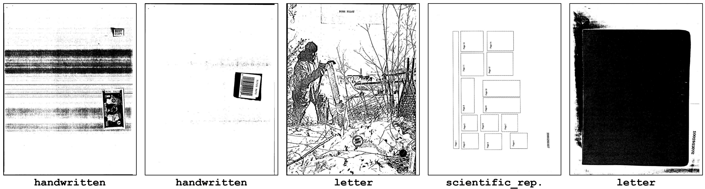
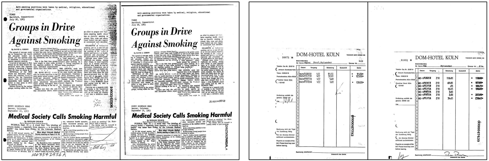
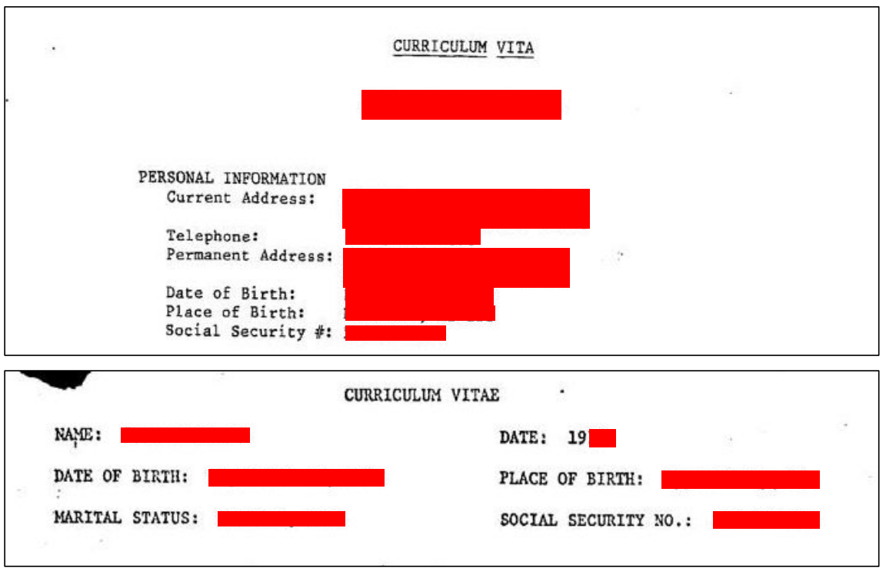

# On Evaluation of Document Classifiers using RVL-CDIP

This is the companion page for the paper [On Evaluation of Document Classifiers using RVL-CDIP](https://aclanthology.org/2023.eacl-main.195.pdf) (EACL 2023).
The paper highlights several characteristics in RVL-CDIP, including (1) annotation errors and ambiguities, (2) test-train overlap, making RVL-CDIP a less-than-optimal benchmark for evaluating document classifiers.

## 1. Annotation Issues

We observe several annotation issues in the RVL-CDIP dataset. These include: documents that do not fall within any of the 16 RVL-CDIP categories, documents that do fall within one of the RVL-CDIP categories but are incorrectly labeled, and documents that fit within multiple RVL-CDIP categories.

### 1.1. Unknown Documents

We found a large number of documents that did not belong to any of the 16 RVL-CDIP categories. Examples are shown below.



### 1.2. Wrong Labels

We found a large number of incorrectly-annotated documents that had an incorrect original label, and should have been labeled as a different RVL-CDIP label.
Examples are shown below (red label: original; blue label: our corrected label).


### 1.3. Mixed Documents

The below pair of document images shows two highly similar documents, yet one is labeled as `news_article` in RVL-CDIP, while the other is labeled `letter`.
Both documents have letter-like components, as well as news-article-like components.
This is an example of what we call a `mixed` label ambiguity in our paper.


## 2. Test-Train Overlap

We observed a sizeable amount of documents in the RVL-CDIP test set that have near-duplicates in the train set. Examples are shown below. The pair on the left is a near-duplicate, while the pair on the right is what we call a "template match": two documents that share the same template but differ in the information "filled out" in the template.



## 3. Sensitive Data

We also observed a surprising amount of instances of sensitive data, including US Social Security numbers (SSNs). Example cropped portions of documents with sensitive data are displayed below (redacted by us).



## Citation

If you find our paper useful for your research, please do not hesitate to cite:

```
@inproceedings{larson-etal-2023-evaluation,
    title = "On Evaluation of Document Classifiers using {RVL}-{CDIP}",
    author = "Larson, Stefan  and
      Lim, Gordon  and
      Leach, Kevin",
    booktitle = "Proceedings of the 17th Conference of the European Chapter of the Association for Computational Linguistics",
    month = may,
    year = "2023",
    address = "Dubrovnik, Croatia",
    publisher = "Association for Computational Linguistics",
    url = "https://aclanthology.org/2023.eacl-main.195",
    pages = "2657--2670"
}
```
