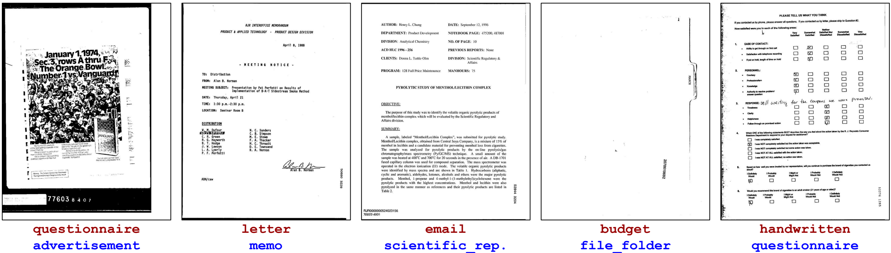
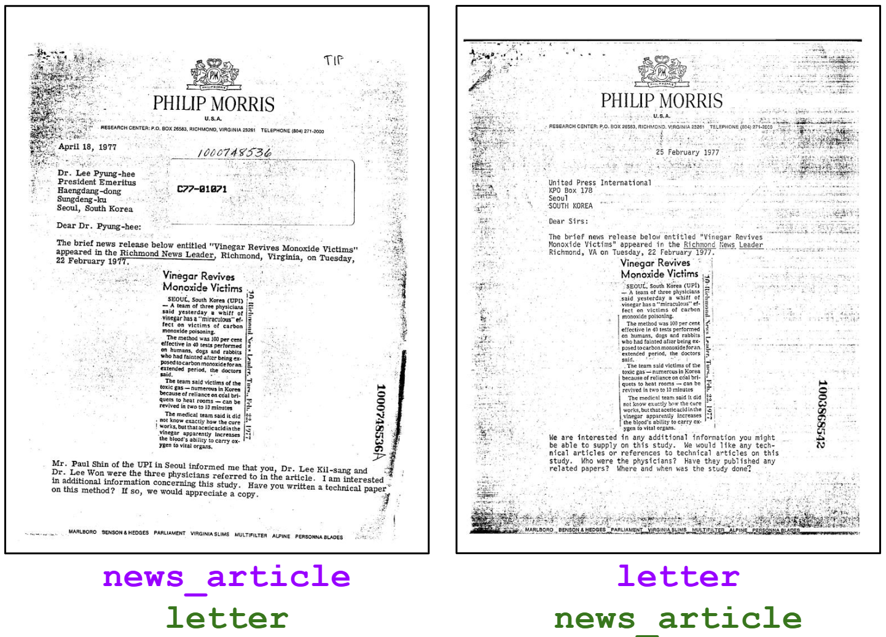

# On Evaluation of Document Classifiers using RVL-CDIP

This is the companion page for the paper [On Evaluation of Document Classifiers using RVL-CDIP](https://aclanthology.org/2023.eacl-main.195.pdf) (EACL 2023).
The paper highlights several characteristics in RVL-CDIP, including (1) annotation errors and ambiguities, (2) test-train overlap, making RVL-CDIP a less-than-optimal benchmark for evaluating document classifiers.

## Annotation Issues

### Unknown Documents

### Wrong Labels

We found a large number of incorrectly-annotated documents that had an incorrect original label, and should have been labeled as a different RVL-CDIP label.
Examples are shown below (red label: original; blue label: our corrected label).



### Mixed Documents

The below pair of document images shows two highly similar documents, yet one is labeled as `news_article` in RVL-CDIP, while the other is labeled `letter`.
Both documents have letter-like components, as well as news-article-like components.
This is an example of what we call a `mixed` label ambiguity in our paper.



## Test-Train Overlap

## Sensitive Data

## Citation

If you find our paper useful for your research, please do not hesitate to cite:

```
@inproceedings{larson-etal-2023-evaluation,
    title = "On Evaluation of Document Classifiers using {RVL}-{CDIP}",
    author = "Larson, Stefan  and
      Lim, Gordon  and
      Leach, Kevin",
    booktitle = "Proceedings of the 17th Conference of the European Chapter of the Association for Computational Linguistics",
    month = may,
    year = "2023",
    address = "Dubrovnik, Croatia",
    publisher = "Association for Computational Linguistics",
    url = "https://aclanthology.org/2023.eacl-main.195",
    pages = "2657--2670"
}
```
